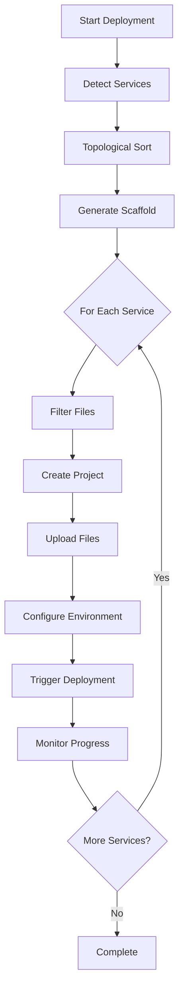

# Monorepo Deployment Support

This document describes the monorepo deployment functionality that enables automatic deployment of fullstack monorepo projects with multiple services.

## Overview

The monorepo deployment strategy handles the deployment of projects with multiple services (e.g., frontend and backend) that may have dependencies on each other. It ensures services are deployed in the correct order and automatically configures inter-service communication.

## Features

### 1. Service Detection

Automatically detects services from the scaffold configuration:

- **Backend Service (API)**: Express/Fastify/NestJS backend
- **Frontend Service (Web)**: Next.js/React frontend

```typescript
const services = strategy.detectServices(config);
// Returns: [
//   { name: 'api', type: 'backend', dependencies: [] },
//   { name: 'web', type: 'frontend', dependencies: ['api'] }
// ]
```

### 2. Dependency Resolution

Uses topological sorting to determine the correct deployment order:

- Services with no dependencies are deployed first
- Dependent services are deployed after their dependencies
- Circular dependencies are detected and reported

```typescript
const deploymentOrder = strategy.topologicalSort(services);
// Returns: [api, web] - API deployed before Web
```

### 3. File Filtering

Intelligently filters files for each service:

- **Service-specific files**: `apps/{service-name}/**`
- **Shared packages**: `packages/**`, `libs/**`, `shared/**`
- **Root configuration**: `package.json`, `turbo.json`, `tsconfig.json`, etc.

```typescript
const filter = new FileFilter();
const webFiles = filter.filterForService(webService, allFiles);
// Returns only files needed for the web service
```

### 4. Inter-Service Configuration

Automatically configures environment variables for service communication:

- Deployed service URLs are passed to dependent services
- Frontend services receive `NEXT_PUBLIC_API_URL` for client-side access
- Backend services receive `API_URL` for server-side communication

### 5. Multi-Service Progress Tracking

Tracks deployment progress for each service independently:

- Individual service status (pending, building, deploying, success, failed)
- Service-specific build logs
- Service URLs displayed when deployment completes

## Usage

### Basic Deployment

```typescript
import { getMonorepoDeploymentStrategy } from '@/lib/deployment';

const strategy = getMonorepoDeploymentStrategy();

const deployment = await strategy.deploy(config, userId);

// Access deployed services
deployment.services.forEach(service => {
  console.log(`${service.name}: ${service.url}`);
});
```

### With Deployment Orchestrator

The deployment orchestrator automatically detects monorepo projects and uses the appropriate strategy:

```typescript
import { getDeploymentOrchestrator } from '@/lib/deployment';

const orchestrator = getDeploymentOrchestrator();

// Automatically uses MonorepoDeploymentStrategy for fullstack-monorepo
const deployment = await orchestrator.deploy(config, userId);
```

## Architecture

### Service Detection

Services are detected based on the `projectStructure` field:

```typescript
if (config.projectStructure === 'fullstack-monorepo') {
  // Detect backend service
  services.push({
    name: 'api',
    type: 'backend',
    buildCommand: 'npm run build --filter=api',
    startCommand: 'npm start --filter=api',
    environmentVariables: backendEnvVars,
    dependencies: [],
  });

  // Detect frontend service
  services.push({
    name: 'web',
    type: 'frontend',
    buildCommand: 'npm run build --filter=web',
    startCommand: 'npm start --filter=web',
    environmentVariables: frontendEnvVars,
    dependencies: ['api'],
  });
}
```

### Environment Variable Splitting

Environment variables are split between services:

**Backend (API)**:
- `DATABASE_URL`
- `NEXTAUTH_SECRET`
- `ANTHROPIC_API_KEY`
- All non-public variables

**Frontend (Web)**:
- `NEXT_PUBLIC_*` variables
- `NEXTAUTH_URL`
- `API_URL` (auto-configured from deployed API)

### Deployment Flow



## File Filtering

### Included Files

For each service, the following files are included:

1. **Service-specific files**:
   - `apps/{service-name}/**`

2. **Shared packages**:
   - `packages/**`
   - `libs/**`
   - `shared/**`

3. **Root configuration**:
   - `package.json`
   - `package-lock.json` / `yarn.lock` / `pnpm-lock.yaml`
   - `turbo.json`
   - `tsconfig.json`
   - `.gitignore`
   - `.env.example`
   - `README.md`

### File Validation

The file filter validates that each service has:

- ✅ `package.json` (required)
- ✅ Service-specific files (required)
- ⚠️ Entry point file (warning if missing)

## Progress Tracking

### Service-Level Progress

Each service has its own progress state:

```typescript
type ServiceProgress = {
  name: string;
  status: 'pending' | 'building' | 'deploying' | 'success' | 'failed';
  message: string;
  url?: string;
  buildLogs?: string[];
};
```

### Progress Updates

```typescript
// Update service status
progressTracker.updateService(
  deploymentId,
  'api',
  'building',
  'Building API service...'
);

// Add service logs
progressTracker.updateServiceLogs(
  deploymentId,
  'api',
  'Installing dependencies...'
);

// Complete all services
progressTracker.completeMultiService(
  deploymentId,
  new Map([
    ['api', 'https://api.example.com'],
    ['web', 'https://web.example.com']
  ])
);
```

## Configuration

### Deployment Timeout

Monorepo deployments have a longer timeout (10 minutes vs 5 minutes):

```typescript
const strategy = getMonorepoDeploymentStrategy();
strategy.setDeploymentTimeout(15 * 60 * 1000); // 15 minutes
```

### Custom File Filtering

```typescript
const filter = new FileFilter({
  includeSharedPackages: true,
  includeRootConfig: true,
  customIncludes: ['scripts/**'],
  customExcludes: ['**/*.test.ts'],
});
```

## Error Handling

### Service Deployment Failure

If a service fails to deploy:

1. The error is captured and logged
2. The service status is set to 'failed'
3. The entire deployment is marked as failed
4. Subsequent services are not deployed

### Dependency Errors

If a dependency is missing:

```typescript
// Throws error: "Dependency 'api' not found for service 'web'"
```

If a circular dependency is detected:

```typescript
// Throws error: "Circular dependency detected involving service: web"
```

## Testing

Run the test suite:

```bash
bun run src/lib/deployment/__test-monorepo.ts
```

Tests cover:
- ✅ Service detection
- ✅ Topological sorting
- ✅ File filtering
- ✅ File validation
- ✅ Filter statistics

## Requirements Mapping

This implementation satisfies the following requirements:

- **7.1**: Detect all deployable services in a monorepo
- **7.2**: Create separate projects for each service
- **7.3**: Allow independent environment variables per service
- **7.4**: Automatically configure service URLs
- **7.5**: Deploy services in correct dependency order
- **7.6**: Display URLs for all deployed services

## Future Enhancements

1. **Multiple Backend Services**: Support for multiple API services
2. **Database Services**: Automatic database provisioning per service
3. **Service Health Checks**: Verify services are healthy before deploying dependents
4. **Parallel Deployment**: Deploy independent services in parallel
5. **Rollback Support**: Rollback all services if one fails
6. **Service Scaling**: Configure scaling settings per service

## API Reference

### MonorepoDeploymentStrategy

```typescript
class MonorepoDeploymentStrategy {
  deploy(config: DeploymentConfig, userId: string): Promise<Deployment>
  detectServices(config: ScaffoldConfig): DeploymentService[]
  setDeploymentTimeout(timeoutMs: number): void
}
```

### FileFilter

```typescript
class FileFilter {
  filterForService(service: DeploymentService, allFiles: GeneratedFile[]): GeneratedFile[]
  filterForServices(services: DeploymentService[], allFiles: GeneratedFile[]): Map<string, GeneratedFile[]>
  validateServiceFiles(service: DeploymentService, files: GeneratedFile[]): FileValidationResult
  getFilterStats(service: DeploymentService, allFiles: GeneratedFile[]): FileFilterStats
}
```

### ProgressTracker (Extended)

```typescript
class ProgressTracker {
  updateService(deploymentId: string, serviceName: string, status: string, message: string, url?: string): void
  updateServiceLogs(deploymentId: string, serviceName: string, logs: string | string[]): void
  completeMultiService(deploymentId: string, serviceUrls: Map<string, string>): void
  getServiceState(deploymentId: string, serviceName: string): ServiceProgress | undefined
}
```
